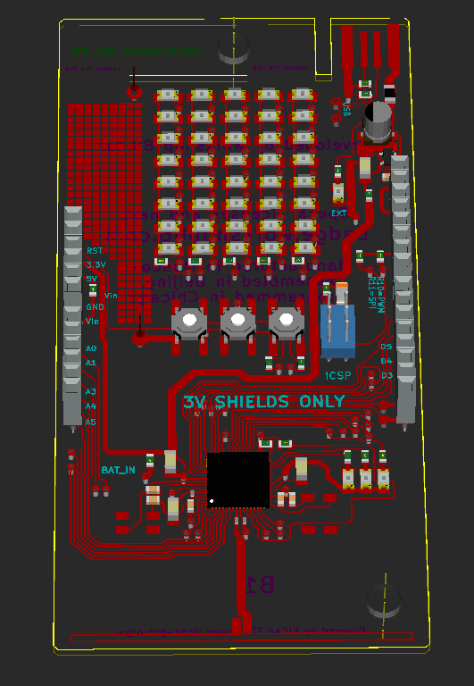



<ul class="posts">
  
    <li>{{ post.date | date_to_string }} &raquo; <a href="{{ BASE_PATH }}{{ post.url }}">{{ post.title }}</a></li>
  
</ul>

Links to other Badge Related Posts: 
<ul><li> 
Kyle Essobi was the first to pull the firmware: <a href="http://www.repyoblog.com/index.php/2013/05/thotcon-0x4-badge/">read more here</a>
</li></ul>
 
